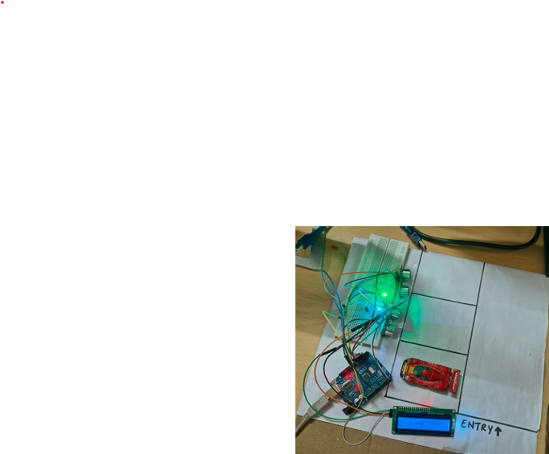
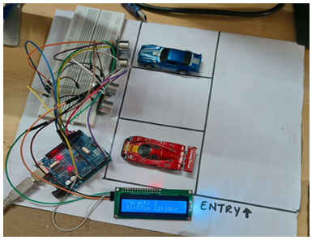
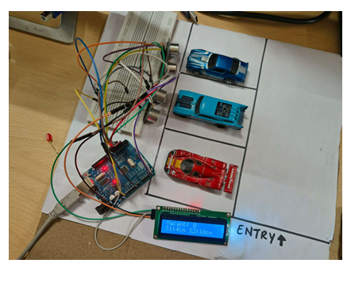

# Smart Parking System

## Overview

This project implements a smart parking slot detection system using Arduino UNO, ultrasonic sensors, LED indicators, and an I²C LCD display.

The system automatically detects whether parking slots are occupied or vacant and displays the number of available parking spaces in real time.

## Components Used

* Arduino UNO
* Ultrasonic Sensors
* 16x2 LCD Display (I²C)
* LEDs
* Breadboard
* Jumper Wires

## Working Principle

Ultrasonic sensors continuously measure the distance between the sensor and nearby objects.

* Distance > 10 cm → Slot Vacant
* Distance < 10 cm → Slot Occupied

The Arduino processes the sensor readings, controls LED indicators, and updates the LCD display with the number of vacant parking slots.

## Features

* Real-time parking slot monitoring
* Visual indication using LEDs
* LCD display for vacant slot count
* Low-cost implementation
* Easy scalability

## Code Functions

* LCD initialization using I²C communication
* Ultrasonic distance measurement
* Vacancy detection logic
* LED control
* LCD status display

## Results

The system successfully detects occupied and vacant parking spaces and updates the available slot count automatically.

## Future Scope

* IoT integration using Blynk or ThingSpeak
* Cloud-based monitoring
* Mobile application support
* AI-based parking analytics
* Smart city parking management systems## Project Images

### Hardware Setup

## Project Report

The complete project report is available in this repository.
